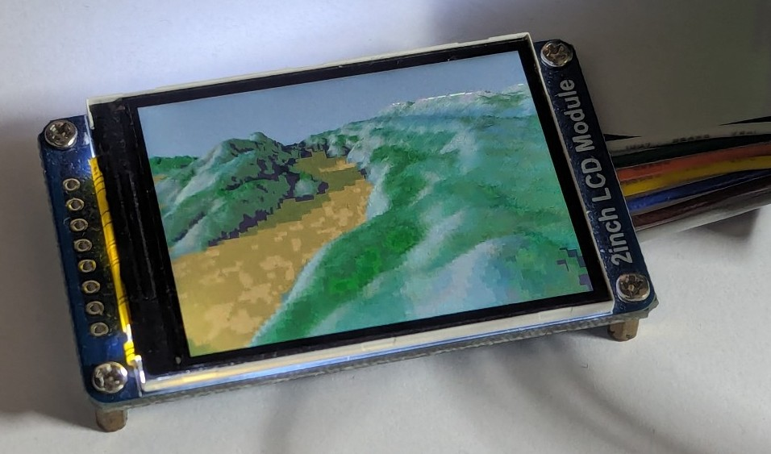
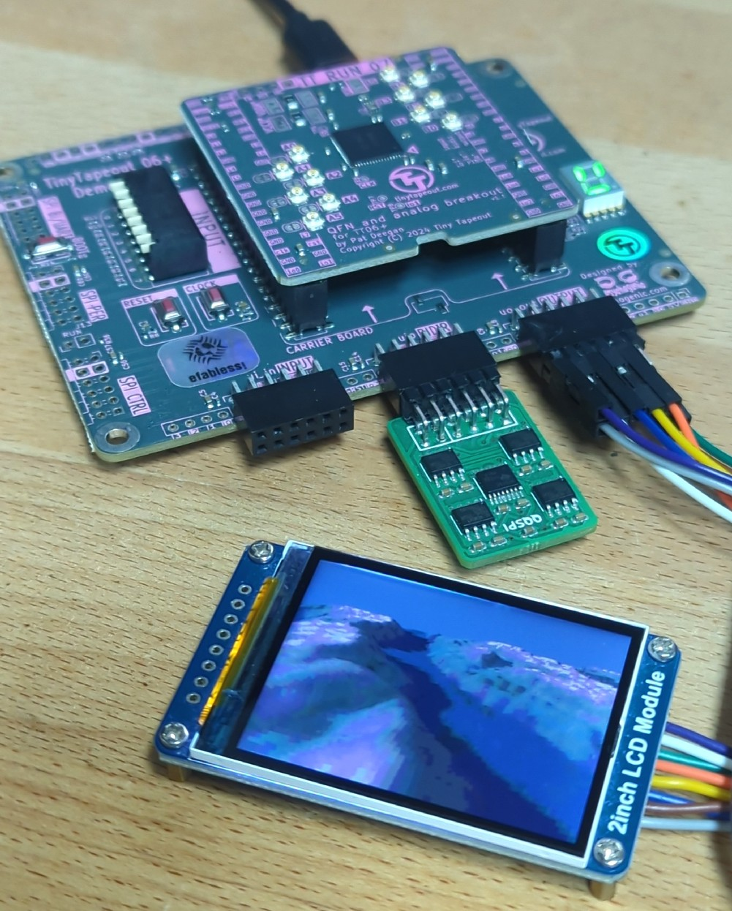

<!---

This file is used to generate your project datasheet. Please fill in the information below and delete any unused
sections.

You can also include images in this folder and reference them in the markdown. Each image must be less than
512 kb in size, and the combined size of all images must be less than 1 MB.
-->

> Note: Silice now supports Tiny Tapeout natively, see e.g. the [Silice tt09 framework](https://github.com/sylefeb/tt09-silice-template). This project was done before this support was implemented, which is why the Silice source is [outside this repo](https://github.com/sylefeb/Silice/tree/wip/projects/qspi_terrain), while this repo contains only the compiled Verilog in `src`.

## How it works

This design performs a 2D 'voxel' raycasting of a terrain, implementing in
actual hardware the 1992 [Voxel Space](https://en.wikipedia.org/wiki/Voxel_Space) algorithm used in the Comanche game.

The chip is designed in [Silice](https://github.com/sylefeb/Silice/),
the source code is in the [main repo](https://github.com/sylefeb/Silice/tree/wip/projects/qspi_terrain).

## How to test

A specific data file containing terrain data has to be uploaded to SPI-ram
before this can run. The plan is to do that from the RP2040 of the PCB.

Another way to test is on a IceStick HX1K. Instructions coming soon!

## Making it work on silicon!

This design was tapped out on TT07 and has been
[tested to work in silicon](https://mastodon.online/@sylefeb/113924343576976008)!!!
Yay!!!

Below is a picture of the setup, the pinout [is here](../info.yaml).
See also [External hardware](#external-hardware) below.
 

A specificity of the design is that it uses PSRAM to store lookup tables. There
have to be pre-loaded into the PSRAM mmod. What's more is that the PSRAM has
to be initialized in QPI mode (Quad-SPI, using four wires for increased
bandwidth). The design does not do it to save on logic size ... (!!).

How can this be achieved? Well, the TinyTapeout demo board has everything planned
for us! We can use a dedicated (web) tool to upload the data into the pmod.
This tool is the [tinytapout-flasher by urich](https://github.com/TinyTapeout/tinytapeout-flasher). I [modified it]() to initialize the PSRAM in
QPI.

- Go to [my version of the flasher](https://sylefeb.github.io/tinytapeout-flasher/) (WebSerial support required, e.g. Chrome)
- Connect the board + TT07 chip, select 'Explorer', click 'Flash' and wait
- Disconnect
- Go to the [Tiny Tapeout Commander](https://commander.tinytapeout.com/)
- Connect the board + TT07 chip
- In index enter 322 (Explorer), click 'Select'
- In clock speed enter 1000000, click SET (1 MHz to start)
- Select 'Interact'
- Hit 'Reset'
- The screen should start to draw very slowly
- Check 'ui_in', select '2' (the view will move forward, '0' and '1' go right/left)
- Go back to 'Config', try to increase the speed. Mine works at 17.5 MHz, but this may depend on your PSRAM specific timings.

## External hardware

- [QSPI PSRAM PMOD from machdyne](https://machdyne.com/product/qqspi-psram32/)
- 240x320 ST7789V screen
